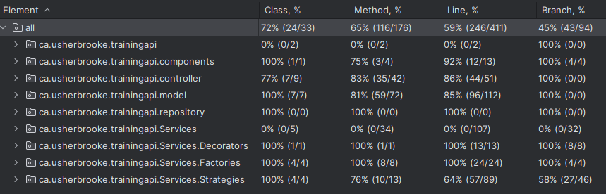

# TrainingApp

Projet de session pour le cours IFT785 – Approches orientées objets

## Context

L'application permet de gérer des entraînements dans divers disciplines comme le sport ou les jeux vidéo.
Elle est conçue pour être extensible et modulaire, facilitant l'ajout de nouvelles fonctionnalités à l'avenir.

## Features
 - Gestion des disciplines
 - Gestion des entraînements
 - Gestion des exercices
 - Gestion des sessions d'entraînement
 - Gestion des session d'exercices
 - Retour de données statistiques sur les entraînements et des exercices

## Design pattern implémentés
- Factory : Fournit des stratégies de calcul de statistiques en fonction du type d'objet (Training ou Exercice) et du type de statistique souhaité.
- Strategy : Adapte la stratégie de calcul statistique à appliquer sur un objet (Training ou Exercice) en fonction du type de statistque souhaité.
- Decorator : Permet de retourner des exercices/trainings décorés avec leurs statistiques sans changer la structure de base.
- Command : (Implémenté dans l'application front) Permet de gérer le lancement/la mise en pause/l'arret des entrainements.
- Adapter : (Implémenté dans l'application front) Permet de convertir les données de l'api vers les diagrammes de la librairie ApexChart.
- Dependancy Injection : Permet de gérer les dépendances entre les classes et d'injecter des objets dans les classes qui en ont besoin.
- Repository : Permet de gérer la persistante des données.

## Installation

Cette API peut être utilisée avec une interface graphique disponible sur ce dépot git : 

### Backend
1. Cloner le dépot : 
```sh
git clone https://github.com/AlexLomas37/TrainingApp_back.git
```
2. Ouvrir le projet dans IntelleJ IDEA
3. Configurer le JDK 17
4. Configurer la base de données H2
5. Lancer le projet ou alors générer un fichier war et le déployer sur un serveur d'application comme Tomcat. 
6. Accéder à l'API via `http://localhost:8090`

### Frontend (optionnel)
1. Cloner le dépôt :
   ```sh
   git clone https://github.com/AlexLomas37/TrainingApp_front.git
   ```
2. Installer les dépendances :
   ```sh
   npm install
   ```
3. Démarrer le serveur de développement :
   ```sh
   npm run dev
   ```
4. Accéder au site web via `http://localhost:3000`

## Choix Architecturaux

### Structure
Le projet est structuré de manière à séparer les différentes couches de l'application :
- `controller` : Contient les classes qui gèrent les requêtes HTTP et les réponses.
- `repository` : Contient les classes qui gèrent l'accès aux données.
- `model` : Contient les classes qui représentent les données de l'application.
- `decorator` : Contient les classes qui gèrent les décorateurs de l'application.
- `strategy` : Contient les classes qui gèrent les stratégies de l'application.
- `factory` : Contient les classes qui gèrent les fabriques de l'application.
- `service` : Contient les classes qui gèrent la logique métier de l'application en interagissant avec les modèles.
- `components` : Contient les classes qui gèrent les composants de l'application.

Cette séparation en couche permet de mieux organiser le code et de faciliter la maintenance de l'application tout en respectant les principes SOLID.

## Technologies
- Java 17
- Framework Spring Boot
- mysql pour la base de données
- IntelleJ IDEA pour le développement de l'API

## Analyse de tests
L'application est testée avec JUnit 5 et Mockito. Les tests sont organisés par couche :

- `unit` : Tests unitaires de l'application.
  - `model` : Tests des modèles de l'application.
  - `component` : Tests des composants de l'application.
    - `StatisticsFactoryProviderTests` : Tests de la fabrique de statistiques.
  - `service` : Tests des services de l'application.
    - `decorator` : Tests des décorateurs de l'application.
    - `strategy` : Tests des stratégies de l'application.
    - `factory` : Tests des fabriques de l'application.
- `integration` : Tests d'intégration de l'application.
  - `controller` : Tests des contrôleurs de l'application.
  - `TrainingApiApplicationTests` : Tests de l'applicaiton en ajoutant des données à la base de données.
- `e2e` : Tests de bout en bout de l'application (Non présent dans l'API).

### Couverture de tests


## Routes
Lien vers swagger-ui : http://localhost:8090/swagger-ui/index.html

### Test
| Méthode | Route  | Description                                              |
|---------|--------|----------------------------------------------------------|
| GET     | /      | Affiche un message pour dire que l'api est fonctionnelle |

### Discipline
| Méthode | Route                       | Description                                      |
|---------|-----------------------------|--------------------------------------------------|
| GET     | /disciplines                | Récupère la liste des disciplines                |
| GET     | /disciplines/{id}           | Récupère une discipline par son identifiant      |
| GET     | /disciplines/{id}/trainings | Récupère la liste des trainings d'une discipline |
| POST    | /disciplines                | Crée une nouvelle discipline                     |
| PUT     | /disciplines/{id}           | Met à jour une discipline existante              |
| PATCH   | /disciplines/{id}           | Met à jour partiellement une discipline          |
| DELETE  | /disciplines/{id}           | Supprime une discipline                          |

### Entraînement
| Méthode | Route                     | Description                                       |
|---------|---------------------------|---------------------------------------------------|
| GET     | /trainings                | Récupère la liste des entraînements               |
| GET     | /trainings/{id}           | Récupère un entraînement par son identifiant      |
| GET     | /trainings/{id}/exercices | Récupère la liste des exercices d'un entraînement |
| POST    | /trainings                | Crée un nouvel entraînement                       |
| PUT     | /trainings/{id}           | Met à jour un entraînement existant               |
| PATCH   | /trainings/{id}           | Met à jour partiellement un entraînement          |
| DELETE  | /trainings/{id}           | Supprime un entraînement                          |

### Exercice
| Méthode | Route                          | Description                                    |
|---------|--------------------------------|------------------------------------------------|
| GET     | /exercices                     | Récupère la liste des exercices                |
| GET     | /exercices/{id}                | Récupère un exercice par son identifiant       |
| POST    | /exercices                     | Crée un nouvel exercice                        |
| PUT     | /exercices/{id}                | Met à jour un exercice existant                |
| PATCH   | /exercices/{id}                | Met à jour partiellement un exercice           |
| DELETE  | /exercices/{id}                | Supprime un exercice                           |

### Session d'entraînement
| Méthode | Route                                    | Description                                                     |
|---------|------------------------------------------|-----------------------------------------------------------------|
| GET     | /training-sessions                       | Récupère la liste des sessions d'entraînement                   |
| GET     | /training-sessions/{id}                  | Récupère une session d'entraînement par son identifiant         |
| GET     | /training-sessions/training/{idTraining} | Récupère la liste des sessions d'entraînement d'un entraînement |
| POST    | /training-sessions                       | Crée une nouvelle session d'entraînement                        |
| PUT     | /training-sessions/{id}                  | Met à jour une session d'entraînement existante                 |
| PATCH   | /training-sessions/{id}                  | Met à jour partiellement une session d'entraînement             |
| DELETE  | /training-sessions/{id}                  | Supprime une session d'entraînement                             |

### Session d'exercice
| Méthode | Route                                    | Description                                             |
|---------|------------------------------------------|---------------------------------------------------------|
| GET     | /exercice-sessions                       | Récupère la liste des sessions d'exercices              |
| GET     | /exercice-sessions/{id}                  | Récupère une session d'exercice par son identifiant     |
| GET     | /exercice-sessions/exercice/{idExercice} | Récupère la liste des sessions d'exercice d'un exercice |
| POST    | /exercice-sessions                       | Crée une nouvelle session d'exercice                    |
| PUT     | /exercice-sessions/{id}                  | Met à jour une session d'exercice existante             |
| PATCH   | /exercice-sessions/{id}                  | Met à jour partiellement une session d'exercice         |
| DELETE  | /exercice-sessions/{id}                  | Supprime une session d'exercice                         |

### Statistiques
| Méthode | Route                               | Description                                                                         |
|---------|-------------------------------------|-------------------------------------------------------------------------------------|
| GET     | /statistics/trainings/total         | Récupère le total des                                                               |
| GET     | /statistics/trainings/heatmap       | Récupère la carte de fréquentations des sessions entraînements                      |
| GET     | /statistics/exercises/curve/nbTimes | Récupère les statistiques d'un exercice en fonction des x dernières fois            |
| GET     | /statistics/exercises/curve/dates   | Récupère les statistiques d'un exercice en fonction du temps                        |
| GET     | /statistics/exercises/avg/nbTimes   | Récupère les différentes moyennes pour un exercice en fonction des x dernières fois |
| GET     | /statistics/exercises/avg/dates     | Récupère les différentes moyennes pour un exercice en fonction du temps             |

### Type de statistiques
| Méthode | Route            | Description                                                                         |
|---------|------------------|-------------------------------------------------------------------------------------|
| GET     | /statistic-types | Récupère la liste des types de statistiques                                         |

### Décorateurs
| Méthode | Route                      | Description                                  |
|---------|----------------------------|----------------------------------------------|
| GET     | /decorators/trainings/{id} | Décore un entraînement avec ses statistiques |
| GET     | /decorators/exercices/{id} | Décore un exercice avec ses statistiques     |

Note : Il y a un fichier postman qui regroupe divers tests de routes à la racine du projet, dans le répertoire `Postman`.

## Date de remise
 17 avril 2025

## Auteur
Alexandre Lomaszewicz